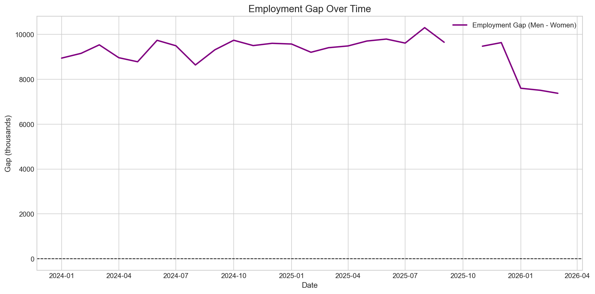

## Example Insight

# Demography Hiring Analysis

This project simulates how a company can replace inefficient Excel-based workforce reporting with an automated analytics pipeline using real labor market data from the Bureau of Labor Statistics (BLS).

## Why This Project Matters

Many organizations rely on fragmented Excel files and manual processes to understand workforce trends. This project demonstrates how those inefficiencies can be replaced with a structured, automated approach to analyzing labor market data.

By transforming raw labor statistics into a clean, unified dataset, this analysis makes it possible to quickly answer critical business questions such as:

- Are unemployment trends different between men and women?
- Is workforce participation increasing or declining?
- Where are potential labor shortages or disengagement risks?
- Are there gaps between employment growth and participation?

Instead of manually combining multiple files and performing repetitive calculations, this project automates the entire workflow and produces clear, decision-ready insights.

### Business Value

- Enables faster and more reliable reporting
- Reduces manual data handling errors
- Identifies workforce trends that impact hiring and planning
- Supports data-driven decisions for recruiting and workforce strategy

## What I Did

- Built a reusable pipeline to clean and standardize multiple raw data files
- Combined fragmented datasets into one unified analysis table
- Automated repetitive Excel-style transformations using Python
- Created business-focused metrics such as employment and participation gaps
- Translated raw data into clear insights and decision-ready visualizations

## Project Overview

The notebook builds a complete end-to-end analysis pipeline:

- Ingests all datasets from `data/` as source of truth
- Cleans and standardizes each BLS file
- Aligns all series by monthly `Date`
- Merges into one analytics dataset
- Engineers gap and growth features
- Produces portfolio-ready charts and interprets findings
- Saves outputs to `outputs/`

## Data Sources

All datasets are from the BLS Current Population Survey and are stored in `data/`:

- `Men_BLS.csv` (Employment Level - Men)
- `Women_BLS.csv` (Employment Level - Women)
- `Employment Level_25-54 yrs.csv` (Prime-age Employment Level)
- `Unemployment Rate - Men.csv`
- `Unemployment Rate - Women.csv`
- `Labor Force Participation Rate - Men.csv`
- `Labor Force Participation Rate - Women.csv`

## Methodology

1. **Data cleaning**
   - Keep monthly observations only (`M01` to `M12`)
   - Convert `Value` to numeric and handle `-` as missing
   - Parse `Label` into datetime
   - Standardize metric column names

2. **Data alignment and merge**
   - Merge all cleaned series on `Date`
   - Build a single analysis table with:
     - `Men_Employment`, `Women_Employment`, `Prime_Age_Employment`
     - `Men_Unemployment`, `Women_Unemployment`
     - `Men_Participation`, `Women_Participation`

3. **Feature engineering**
   - `Employment_Gap = Men_Employment - Women_Employment`
   - `Participation_Gap = Men_Participation - Women_Participation`
   - `Unemployment_Gap = Men_Unemployment - Women_Unemployment`
   - Month-over-month growth rates for employment series

4. **Visualization and interpretation**
   - Men vs women employment trends
   - Employment gap trend
   - Unemployment comparison
   - Participation comparison
   - Prime-age employment trend
   - Participation vs unemployment driver view

   ## Why This Matters for Decision-Making

This analysis shows that workforce differences are driven more by participation than unemployment, meaning the main challenge is not job availability but workforce engagement.

For a business or recruiting team, this insight can shift focus from hiring volume to understanding why certain groups are less active in the labor force.

## Key Findings

These takeaways are based on **monthly, seasonally adjusted** BLS series from early 2024 through early 2026. Numbers are directional for this sample window, not long-run forecasts.

### Labor market and gender patterns

- **Employment:** Women’s employment rose much more than men’s in level terms (thousands of workers), while men’s employment was comparatively flat. The **gender employment gap (men minus women) narrowed**—so improved parity here is driven mainly by **women’s gains**, not by large male employment losses.
- **Unemployment:** Men’s unemployment rate is **slightly higher on average** than women’s; the **unemployment gap is small** relative to other differences—joblessness is not the dominant story compared with **labor force attachment**.
- **Participation:** Men’s labor force participation exceeds women’s by about **ten percentage points on average**. That **persistent participation gap** is far larger than the unemployment-rate gap, which supports framing the **employment-level gap** as **participation-heavy** in this period: *who is in the labor force* matters more than *who is unemployed among those in the labor force*.
- **Prime age (25–54):** Prime-age employment **rose** over the window, consistent with **broad labor demand** for core working-age adults. Gender trends should be read **within** that macro context.

### Data availability gap

- **October 2025 is missing** in every source file used here (BLS `-` treated as missing). Charts show a **break** between September and November 2025; **November–December 2025 and January 2026 are present**.
- **Why it matters:** You cannot interpret a smooth trend through that month or trust **month-over-month** steps that would cross October without calling out the hole.
- **What we did:** **No imputation**—missing stays missing; findings emphasize valid months and transparent documentation.

### How this maps to the business questions

| Question | Takeaway |
|----------|----------|
| How has the employment gap changed? | It **narrowed**, with **women’s employment growing faster** than men’s. |
| Participation vs. unemployment? | **Participation differences dominate** in magnitude; unemployment spreads are secondary here. |
| Unemployment by gender? | **Men slightly higher on average**; gap is modest. |
| Prime-age vs. overall? | **Prime-age employment rose**; gender story sits inside a generally **stronger core labor market** reading. |
| Women up, men down, or both? | Mostly **women up**; men **roughly flat**—not a “men declining” story in these levels. |

## Outputs

Running `notebooks/analysis.ipynb` generates:

- Clean dataset: `outputs/cleaned_data.csv`
- Charts:
  - `outputs/01_men_vs_women_employment.png`
  - `outputs/02_employment_gap_over_time.png`
  - `outputs/03_unemployment_comparison.png`
  - `outputs/04_participation_comparison.png`
  - `outputs/05_prime_age_employment_trend.png`
  - `outputs/06_gap_driver_participation_vs_unemployment.png`
- Text summary: `outputs/insights_summary.txt`

## Tools

- Python
- Pandas
- Matplotlib
- Jupyter Notebook